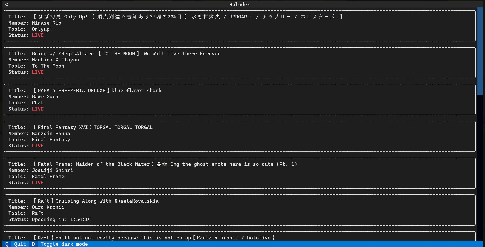

# holodex-cli
A `textual` based interface for `Holodex`



## Directions
* Create an API key for your Holodex account.
* Create a copy of example-config.toml called config.toml and paste your key into this file as API_KEY:
```toml
API_KEY = "YOUR_API_KEY_HERE"
```
* Run:
```bash
just install
```
OR
```bash
poetry install
poetry build
pipx install ./dist/`ls -t dist | head -n2 | grep whl`
mkdir -p ~/.local/holodex-cli
cp --update config.toml ~/.local/holodex-cli/config.toml
```

## Usage

<pre>
<b style="color:Orange;">Usage:</b> <b style="color:Gray;">holodex</b> <b>[</b><b style="color:DodgerBlue;">-h</b><b>]</b> <b>[</b><b style="color:DodgerBlue;">-g</b> <b style="color:MediumSeaGreen;">GROUP</b><b>]</b> <b>[</b><b style="color:DodgerBlue;">-r</b> <b style="color:MediumSeaGreen;">RESOLUTION</b><b>]</b> <b>[</b><b style="color:DodgerBlue;">-v</b><b>]</b>

<b style="color:Orange;">Options:</b>
&#9;<b style="color:DodgerBlue;">-h</b>, <b style="color:DodgerBlue;">--help</b>&#9;&#9;show this help message and exit
&#9;<b style="color:DodgerBlue;">-g</b>, <b style="color:DodgerBlue;">--group</b> <b style="color:MediumSeaGreen;">GROUP</b>&#9;the VTuber group you want to watch (default: Hololive)
&#9;<b style="color:DodgerBlue;">-r</b>, <b style="color:DodgerBlue;">--resolution</b> <b style="color:MediumSeaGreen;">RESOLUTION</b>
&#9;&#9;&#9;&#9;the video resolution to play (default: 720)
&#9;<b style="color:DodgerBlue;">-v</b>, <b style="color:DodgerBlue;">--version</b>&#9;&#9;show program's version number and exit
</pre>


*__NOTE:__* Requires `ffplay` to use